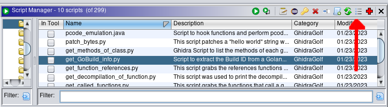
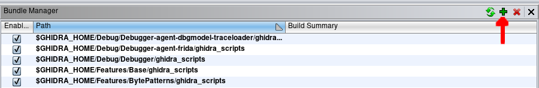
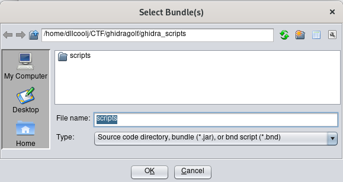
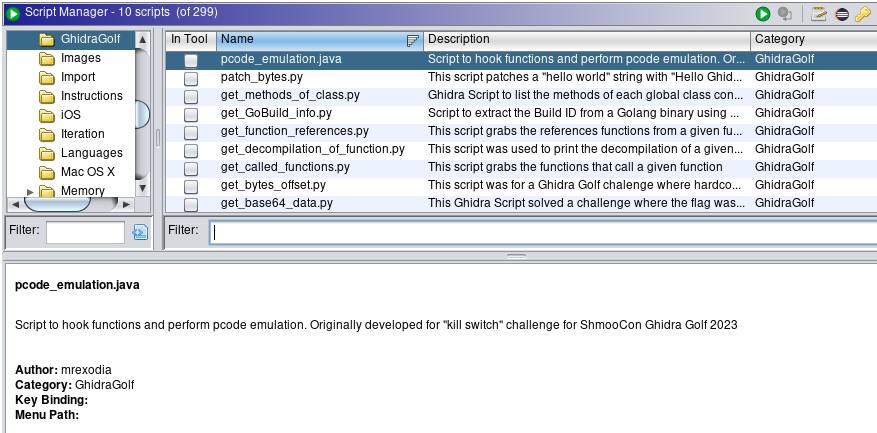

## About
The Ghidra Scripts in this repo are from competitors of the Ghidra Golf competition.
Competitors developed Ghidra Scripts to solve CTF challenges based on common Reverse Engineering problems in an automated fashion.
Competitors opted-in to having their Ghidra Scripts published to this repo for the benefit of the Reverse Engineering community.
The ```@author``` tag represents the original author of the Ghidra Script. 

The Ghidra Golf team hopes that this repo continues to grow with other Ghidra Golf competition
in order to create a collection of scripts the RE community can leverage as a starting point, and build upon.

Thank you to all contributors.

## Adding Ghidra Script Directory
After cloning the repo, perform the following steps:

1. Open Ghidra Script manager, and click on "managing script directories".



2. Next, select the green plus sign to add additional directories.



3. Chose your directory.



4. A "Ghidra Golf" directory will now exist for you to execute the scripts from.



